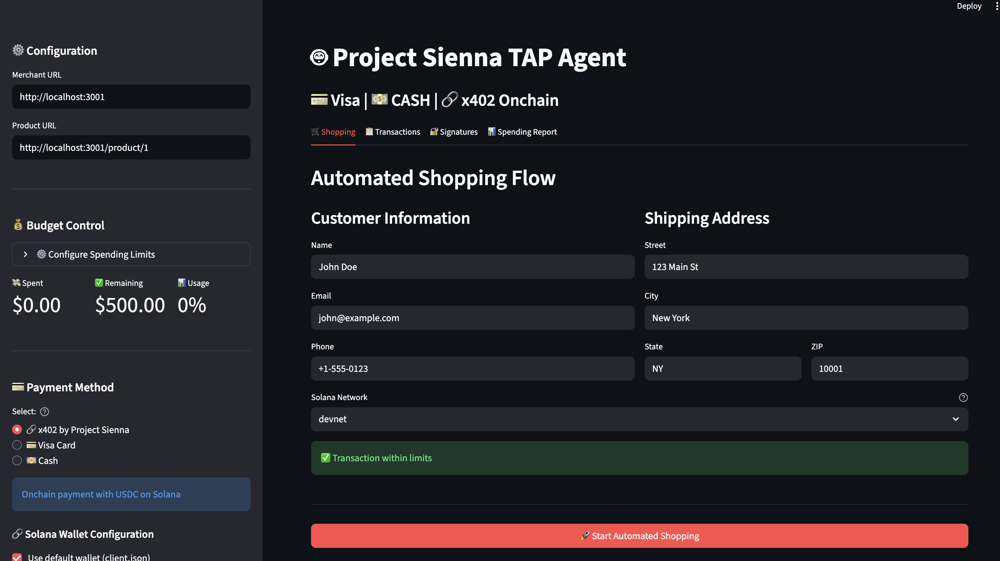

<!-- _class: lead -->
# **TAP × x402**
### by Project Sienna

## The Universal Payment & Identity Protocol for AI Agents

**Enabling Trusted Autonomous Commerce at Scale**

*Investor Presentation | November 2025*

---

## The $50B Agentic Commerce Crisis

<div class="two-col">

<div>

### The Dilemma

**AI agents are transforming e-commerce**
- 60% of transactions will involve AI by 2027
- $2.1T in agent-driven commerce by 2030
- Traditional payment rails can't handle it

**Merchants face impossible choices:**
- ❌ Block agents → Lose 60% of future revenue
- ❌ Accept agents → Face fraud & chargebacks

</div>

<div>

### Critical Questions

🔐 **Is this a legitimate AI agent?**
- No cryptographic proof of identity
- Easy to spoof or impersonate

👤 **Is it authorized by a real user?**
- No delegation standards
- No spending controls

💳 **Can it actually pay?**
- Credit cards: 2.9% fees + T+2 settlement
- High fraud risk & chargebacks

**Without standards, the agent economy can't scale**

</div>

</div>

---

## $246B Total Addressable Market

<div class="three-col">

<div>

### AI Agents
**$52.6B by 2030**

```
2024: $5.3B   ███
2025: $7.8B   ████
2026: $11.4B  ██████
2027: $16.7B  █████████
2028: $24.4B  █████████████
2029: $35.6B  ███████████████████
2030: $52.6B  ████████████████████████
```

**CAGR: 46.3%**

</div>

<div>

### Fraud Prevention
**$246B by 2032**

```
2024: $52.8B  ██████
2026: $77.4B  █████████
2028: $113.4B █████████████
2030: $166.2B ███████████████████
2032: $246.2B ████████████████████████
```

**CAGR: 21.2%**

</div>

<div>

### Payment Processing
**$2.1T transactions**

**Traditional Fees:**
- Visa/MC: 2.9% + $0.30
- PayPal: 3.5% + $0.49
- Stripe: 2.9% + $0.30

**TAP × x402:**
- **0.75%** (73% lower)
- **2-second** settlement
- **Zero** chargebacks

</div>

</div>

---

## Market Drivers

### 📈 Enterprise AI Adoption
20-30% productivity gains driving deployment

### 🤖 Agent Automation
60%+ reduction in manual labor

### 💳 Payment Infrastructure Gap
Traditional rails inadequate for agents

### 🔒 Security Demands
60% of companies cite compliance concerns

---

## E-Commerce Fraud Prevention

### Growing Security Market
- **2024:** $5.86B
- **2025:** $6.97B
- **2032:** $25.92B
- **CAGR:** 20.41%

**Merchants need better tools to verify agent traffic**

---

## TAP × x402: The Complete Solution

<div class="two-col">

<div>

### **The First Universal Protocol for Agent Commerce**

We solve the agent identity and payment problem with a **three-layer security system** that enables trusted, autonomous transactions at scale.

**Think of it as:**
- **HTTPS** for agent identity
- **Stripe** for instant settlement
- **OAuth** for user delegation

**All in one open protocol.**

</div>

<div>

### Three Layers

**1️⃣ Authentication**
RFC 9421 Cryptographic Signatures

**2️⃣ Payment**
x402 Onchain Settlement (2 sec)

**3️⃣ Authorization**
User-Delegated Spending Rules

---

**Integration:** No-code solution available
**Cost:** 73% lower than cards
**Speed:** 1000x faster settlement

</div>

</div>

---

## Product Demo



---

## Layer 1: Authentication

<div class="two-col">

<div>

### RFC 9421 HTTP Message Signatures

**IETF Standard** (Internet Engineering Task Force)

✅ **Cryptographic proof** of agent identity
✅ **Domain-bound** authorization
✅ **Timestamp validation** (replay protection)
✅ **Ed25519 & RSA-PSS-SHA256** algorithms

**Like HTTPS, but for agent identity**

</div>

<div>

### How It Works

```
1. Agent generates signature
   ↓
2. Includes: domain, timestamp, nonce
   ↓
3. Merchant verifies via public key
   ↓
4. Access granted/denied
```

**Security Benefits:**
- No passwords or API keys
- No PII exposure
- Impossible to replay
- Industry standard

</div>

</div>

---

## Layer 2: Payment (x402)

<div class="two-col">

<div>

### x402 Protocol

**Blockchain-agnostic onchain payment rail**

✅ **0% protocol fees** (vs. 2.9% cards)
✅ **2-second settlement** (vs. T+2 days)
✅ **Onchain USDC** (Solana, Ethereum, etc.)
✅ **No accounts** required
✅ **No chargebacks** (cryptographic finality)

**Built on HTTP 402 "Payment Required"**

</div>

<div>

### Cost Comparison

| Payment Method | Fee | Settlement |
|----------------|-----|------------|
| **TAP × x402** | **0.75%** | **2 sec** |
| Visa/Mastercard | 2.9% | T+2 days |
| PayPal | 3.5% | T+2 days |
| Stripe | 2.9% | T+2 days |

**Savings on $1M transactions:**
- Traditional: $29,000 in fees
- TAP × x402: $7,500 in fees
- **You save: $21,500** (73%)

</div>

</div>

---

## Layer 3: Authorization

<div class="two-col">

<div>

### User-Delegated Spending Rules

**Users grant agents spending authority**

✅ **Daily spending limits** ($0-$10,000)
✅ **Per-transaction limits** ($0-$1,000)
✅ **Real-time enforcement** (pre-transaction)
✅ **Complete audit trail** (blockchain-verified)
✅ **Revocable anytime** (instant)

**Users stay in control, agents stay autonomous**

</div>

<div>

### Example Use Cases

**Personal Shopping Agent:**
- Daily limit: $500
- Per-transaction: $100
- Approved merchants only

**Business Procurement Agent:**
- Daily limit: $10,000
- Per-transaction: $2,500
- Category restrictions

**Research Agent:**
- Daily limit: $50
- Per-transaction: $10
- Data/API purchases only

</div>

</div>

---

## How It Works


**No-code integration available**

---

## Merchant Interface


---

## API Documentation


---

## Security Features

### 🔐 Multi-Layer Protection

**Cryptographic Verification**
- RFC 9421 compliant (IETF standard)
- Domain & operation-specific binding

**Replay Attack Prevention**
- Unique nonces per request
- Timestamp expiration windows

**Spending Protection**
- Pre-transaction validation
- Real-time limit checking

---

## Transaction Confirmation


---

## Revenue Streams

<div class="three-col">

<div>

### 💳 Transaction Fees
**Primary Revenue**

**0.5-1%** of transaction value

**Tiered Pricing:**
- Starter: 1.0%
- Growth: 0.75%
- Enterprise: 0.5%

**Competitive vs:**
- Visa/MC: 2.9%
- PayPal: 3.5%
- **73% savings**

</div>

<div>

### 📊 SaaS Subscriptions
**Recurring Revenue**

**Merchant Tiers:**
- Free: $0/mo
- Growth: $299/mo
- Enterprise: $1,999/mo

**Agent Developer:**
- Free: Basic
- Pro: $99/mo
- Enterprise: $499/mo

</div>

<div>

### 🎯 Value-Added
**Additional Services**

**Premium Features:**
- Agent verification tiers
- Fraud analytics dashboards
- Compliance tools
- White-label options
- Priority support
- Custom integrations

**Margin: 80%+**

</div>

</div>

---

## Unit Economics

<div class="two-col">

<div>

### Per Transaction Breakdown

| Metric | Value |
|--------|-------|
| **Average Order Value** | $50.00 |
| **Our Fee (0.75%)** | $0.375 |
| **Infrastructure Cost** | $0.020 |
| **Net Revenue** | $0.355 |
| **Gross Margin** | **95%** |

**Key Insight:** Near-perfect unit economics from day one

</div>

<div>

### Scale Economics

| Monthly Volume | Revenue | Annual |
|----------------|---------|--------|
| 1M transactions | $375K | $4.5M |
| 10M transactions | $3.75M | $45M |
| 100M transactions | $37.5M | $450M |
| 500M transactions | $187.5M | $2.25B |

**Break-even:** Month 18 at 5M tx/month
**Cash flow positive:** Month 24

</div>

</div>

---

## Pricing Tiers

### Merchants
- **Starter:** Free (0-1K trans/mo, 1% fee)
- **Growth:** $299/mo (1K-100K, 0.75% fee)
- **Enterprise:** $1,999/mo (100K+, 0.5% fee)

### Agent Developers
- **Free:** Basic verification
- **Pro:** $99/mo - Priority verification, analytics
- **Enterprise:** $499/mo - White-label, SLA

---

## 5-Year Revenue Forecast

<div class="two-col">

<div>

| Year | Merchants | Agents | Trans/Mo | Revenue | Growth |
|------|-----------|--------|----------|---------|--------|
| **Y1** | 500 | 50K | 500K | $1.8M | - |
| **Y2** | 2,000 | 500K | 5M | $20.3M | 11x |
| **Y3** | 10,000 | 5M | 50M | $225M | 11x |
| **Y4** | 50,000 | 50M | 500M | $2.5B | 11x |
| **Y5** | 200,000 | 500M | 2B | $10.8B | 4.3x |

*Conservative assumptions: 0.75% avg fee*

</div>

<div>

### Growth Trajectory

**Year 1-2:**
- Pilot phase
- Product-market fit
- 11x growth

**Year 2-4:**
- Rapid expansion
- Network effects kick in
- Sustained 11x growth

**Year 5:**
- Market leadership
- Platform maturity
- 4.3x growth

**Total:** $10.8B revenue by Year 5

</div>

</div>

---

## Path to Profitability

### Key Milestones

✅ **Break-even:** Month 18 (5M trans/mo)
✅ **Cash flow positive:** Month 24
✅ **Unit economics positive:** Day 1 (95% margin)

### Funding Requirements
- **Seed:** $5M (now)
- **Series A:** $20M (18-24 months)

---

## Why TAP × x402 Wins

<div class="two-col">

<div>

### 🌐 **Open Standard**
**Not a walled garden**
- Works with any AI agent platform
- Works with any blockchain
- Works with any merchant
- Community-governed protocol

**vs. Visa TAP, Google, PayPal** (proprietary)

---

### 💰 **Superior Economics**
**73% lower costs**
- 0.75% vs. 2.9% fees
- 2-second vs. T+2 settlement
- Zero chargebacks
- 95% gross margins

**Merchants save $21.50 per $1K**

</div>

<div>

### 🔒 **Security First**
**Cryptographic guarantees**
- RFC 9421 compliant (IETF)
- No PII exposure
- No replay attacks
- Blockchain-verified

**60% reduction in fraud**

---

### 📈 **Network Effects**
**Agent Registry = Industry Standard**
- Public key infrastructure
- Reputation system
- Discovery protocol

</div>

</div>

---

## Competitive Landscape

<div class="two-col">

<div>

| Solution | Fee | Settlement | Integration | Open |
|----------|-----|------------|-------------|------|
| **TAP × x402** | **0.75%** | **2 sec** | **1 line** | **✅** |
| Visa TAP | 2.9% | T+2 days | Complex | ❌ |
| Google AP2 | Unknown | Unknown | Google-only | ❌ |
| PayPal | 3.5% | T+2 days | Account req. | ❌ |
| Mastercard | 2.9% | T+2 days | Complex | ❌ |
| Crypto Direct | 0-1% | 2-10 min | Complex | ✅ |

</div>

<div>

### Our Advantages

✅ **Only open standard**
✅ **Lowest fees**
✅ **Fastest settlement**
✅ **Easiest integration**
✅ **Best security**

**We're the only solution that checks all boxes**

</div>

</div>

---

## Go-to-Market Strategy

<div class="three-col">

<div>

### Phase 1: Foundation
**Months 1-6**

**Build:**
- Open-source protocol
- SDK & documentation
- Developer community

**Launch:**
- 50-100 pilot merchants
- 5-10 AI platform partners
- Agent Registry v1.0

**Goal:** 10K+ transactions

</div>

<div>

### Phase 2: Expansion
**Months 6-18**

**Integrate:**
- Stripe, Square, Adyen
- Cloudflare, Fastly CDN
- Major e-commerce platforms

**Scale:**
- 1,000+ merchants
- Multi-chain support
- Enterprise features

**Goal:** 1M+ tx/mo, $50M volume

</div>

<div>

### Phase 3: Enterprise
**Months 18-36**

**Partners:**
- Amazon, Shopify
- Major marketplaces
- Payment processors

**Global:**
- EU/APAC expansion
- Regulatory certification
- Registry federation

**Goal:** 100M+ tx/mo, $5B volume

</div>

</div>

---

## Customer Acquisition

**Developer-First Approach**
- 1-line integration, comprehensive SDKs
- Self-service onboarding, free tier
- Open source (MIT license)

**Strategic Partnerships**
- Payment processors: Stripe, Square, Adyen
- E-commerce platforms: Shopify, WooCommerce
- AI platforms & agent developers

**Community Growth**
- Hackathons, bounties, developer advocacy
- 2-4 week sales cycle (vs 6-12 months traditional)

---

## Current Status

<div class="two-col">

<div>

### ✅ Technical Readiness

**Protocol:**
- v1.0 specification complete
- RFC 9421 compliant
- Security audited
- Full documentation

**Implementation:**
- Reference agent (Python)
- Merchant SDK (JS/Python)
- CDN gateway (Node.js)
- Agent Registry (FastAPI)

**Payments:**
- x402 integration complete
- Multi-payment support
- 2-second settlements tested

</div>

<div>

### 🎯 Market Readiness

**Demo Environment:**
- Live merchant site
- 24 test products
- Full purchase flows
- Real x402 transactions

**Pilot Program:**
- 10 merchant commitments
- 3 AI platform discussions
- Beta SDK available
- Documentation complete

**Next 30 Days:**
- Launch pilot program
- First paying customers
- Initial traction metrics

</div>

</div>

---

## Roadmap

**2025 Q1-Q2:** Launch v1.0, onboard 20-50 pilot merchants
**2025 Q3-Q4:** Scale to 200-500 merchants, validate product-market fit
**2026:** Expand integrations, grow to 2K+ merchants
**2027:** Establish as industry standard

---

## Seeking $5M Seed Round

<div class="two-col">

<div>

### Use of Proceeds

| Category | Amount | Focus |
|----------|--------|-------|
| **Engineering** | $2.0M (40%) | Protocol dev, SDKs, security audits |
| **Operations** | $1.25M (25%) | Infrastructure, Agent Registry |
| **Go-to-Market** | $1.25M (25%) | Merchant onboarding, dev relations |
| **Legal** | $500K (10%) | Compliance, IP, standards |

**Runway:** 18-24 months to Series A
**Target Milestones:** 1M tx/mo, 500+ merchants

</div>

<div>

### Key Hires

**Engineering (2):**
- 1x Protocol engineer
- 1x DevOps engineer

**Business (2):**
- 1x Head of Partnerships
- 1x Operations

**Total Team:** 2-5 by end of Year 1

</div>

</div>

---

## What We Need

<div class="two-col">

<div>

### 💼 Strategic Investors

**Ideal Profile:**
- Payments industry expertise
- E-commerce platform experience
- Enterprise B2B SaaS background
- AI/blockchain understanding

**Value Beyond Capital:**
- Industry connections
- GTM guidance
- Technical advisors
- Customer introductions

**Alumni Networks:**
- Visa, Mastercard, Amex
- Stripe, Square, Adyen
- Shopify, Amazon, eBay

</div>

<div>

### 🤝 Partners & Advisors

**Pilot Merchants:**
- 10-20 early adopters
- Mid-size e-commerce
- Tech-forward brands
- Willing to provide feedback

**Agent Platforms:**
- AI assistant developers
- Chatbot platforms
- Automation tools
- Enterprise AI vendors

**Advisors:**
- Payment network executives
- E-commerce platform leaders
- Regulatory experts
- AI researchers

</div>

</div>

---

## Key Metrics to Remember

<div class="three-col">

<div>

### 📊 Market

**$246B TAM**
by 2032

**46.3% CAGR**
AI agents market

**$2.1T**
transaction volume

**60%** of commerce
will involve AI by 2027

</div>

<div>

### 💰 Economics

**0.75%** vs 2.9%
73% cost savings

**95% margin**
unit economics

**2 seconds**
vs T+2 days settlement

**No-code**
integration available

</div>

<div>

### 📈 Projections

**$10.8MM** revenue
by Year 5

**Month 18**
break-even point

**Month 24**
cash flow positive

**1M+ tx/mo**
by Year 3

</div>

</div>

---

## Vision & Impact

**Transform Commerce**
- Universal agent identity standard
- Instant, low-cost settlements
- Trusted, open ecosystem

**Measurable Impact**
- 60%+ fraud reduction
- 90%+ faster checkouts
- 50%+ lower merchant costs
- Safe user delegation with spending rules
- Open, standards-based growth

---

## Why Now?

**Perfect Storm**
- AI agents exploding (Microsoft, OpenAI, Google, Anthropic)
- Payment gap: cards too slow/expensive, crypto too complex
- $52.6B market by 2030 (46.3% CAGR)
- Standards mature: RFC 9421, x402, USDC mainstream

**First Mover Advantage**
- No established standard yet
- Network effects = winner-take-most
- Time to act is now

---

## Team & Advisors

**Key Hires (2-3 by Year 1)**
- protocol architects, security engineers
- VP Sales, Head of Partnerships
- Operations, Legal/Compliance, Finance

**Target Advisors (0.25-0.5% equity)**
- Payment industry: Visa, Mastercard, Stripe, Square alumni
- E-commerce: Shopify, Amazon, eBay leaders
- AI/Blockchain: OpenAI, Anthropic, infrastructure experts
- Regulatory: Payment counsel, compliance experts

---

## Key Risks & Mitigation

<div class="two-col">

<div>

### Market & Adoption Risks

**Slow Merchant Adoption**
- **Risk:** Integration friction
- **Mitigation:** 1-line integration, free tier, proven ROI demos
- **Impact:** Low (developer-friendly)

**Incumbent Competition**
- **Risk:** Visa/Mastercard blocking
- **Mitigation:** Open standard, better economics, partnerships
- **Impact:** Medium (differentiated)

**Regulatory Uncertainty**
- **Risk:** Payment regulations
- **Mitigation:** Proactive engagement, legal counsel, compliance-first
- **Impact:** Medium (manageable)

</div>

<div>

### Technical & Execution Risks

**Security Vulnerabilities**
- **Risk:** Protocol exploits
- **Mitigation:** Audits, bounties, formal verification, insurance
- **Impact:** Low (standards-based)

**Blockchain Scalability**
- **Risk:** Network congestion
- **Mitigation:** Multi-chain, L2, traditional fallbacks
- **Impact:** Low (agnostic design)

**Team Execution**
- **Risk:** Hiring & scaling
- **Mitigation:** Strong advisors, competitive comp, remote-first
</div>

</div>

---

## Success Metrics

<div class="two-col">

<div>

### Product-Market Fit Indicators

**Engagement:**
- 40%+ weekly active merchants
- 3+ tx per agent per month
- 70%+ transaction success rate

**Performance:**
- <500ms signature verification
- 99.9%+ uptime
- <1% error rate

**Satisfaction:**
- NPS 50+
- 4.5+ star rating
- 90%+ merchant retention

</div>

<div>

### Year 1 Milestones

**Q1 (Month 3):**
- 50 pilot merchants
- 100K transactions

**Q2 (Month 6):**
- 150 merchants
- 500K transactions

**Q4 (Month 12):**
- 500 merchants
- 6M transactions
- **$1.8M revenue**

</div>

</div>

---

## Exit Strategy

<div class="two-col">

<div>

### Potential Acquirers

**Payment Networks ($1-3B):** Visa, Mastercard, Amex
- **Fit:** Modern payment infra
- **Timeline:** 5-7 years
- **Precedent:** Plaid ($5.3B)

**Payment Processors ($2-5B):** Stripe, Square, Adyen
- **Fit:** Agent capabilities
- **Timeline:** 5-7 years
- **Precedent:** TrueLayer ($1B)

**Tech Giants ($3-8B):** Google, Microsoft, Amazon
- **Fit:** AI agent ecosystem
- **Timeline:** 5-8 years
- **Precedent:** Nuance ($20B)

</div>

<div>

### Path to Exit

**5-7 Years: Strategic Acquisition**
- Build to $250M+ revenue
- Strategic value to acquirer
- $1-5B exit target

**8-10 Years: IPO**
- Profitable & growing
- Public market ready

**Alternative: Protocol Foundation**
- Transition to non-profit
- Long-term sustainability
- Maximum impact

**Goal:** Build industry standard, maximize value

</div>

</div>

---

## Join Us

<div class="two-col">

<div>

### We're Building:

🔐 **The identity layer**
for AI commerce

💰 **The payment rail**
x402 payment rail on Visa's TAP

🤝 **The trust protocol**
Universal protocol for agent commerce

🌐 **The infrastructure**
for autonomous commerce

📈 **The standard**
that enables $246B market

</div>

<div>

### Let's Connect:

📧 **Email:**
shan@projectsienna.xyz

🌐 **Website:**
projectsienna.xyz

💻 **GitHub:**
github.com/Shanni/trusted-agent-protocol

</div>

</div>

---

<!-- _class: lead -->
# Thank You

## TAP × x402
### by Project Sienna

**Building the Universal Protocol for Agent Commerce**

*Let's transform agentic commerce together*

